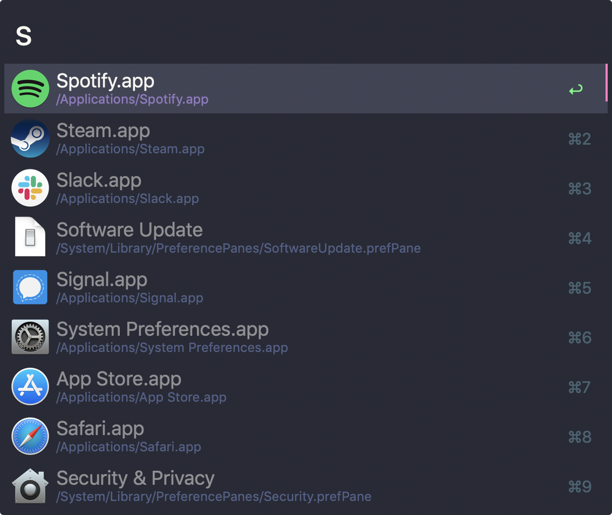

# Dracula for [Alfred 3](http://alfredapp.com)

> A dark theme for [Alfred 3](http://alfredapp.com).

## Preview

## Instructions

All instructions can be found at [draculatheme.com/alfred](https://draculatheme.com/alfred).

## Related

* [Alfred 2](https://github.com/dracula/alfred/tree/v2)

## Team

This theme is maintained by the following person(s) and a bunch of [awesome contributors](https://github.com/dracula/alfred/graphs/contributors).

 |
--- |
[Trevor Heins](https://github.com/heinst) |

## Community

* [Twitter](https://twitter.com/draculatheme) - Best for getting updates about themes and new stuff.
* [GitHub](https://github.com/dracula/dracula-theme/discussions) - Best for asking questions and discussing issues.
* [Discord](https://draculatheme.com/discord-invite) - Best for hanging out with the community.

## License

[MIT License](./LICENSE)
